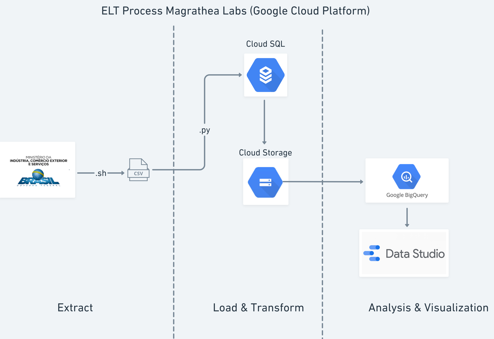
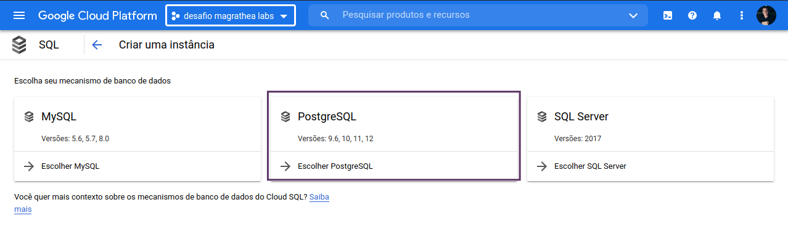
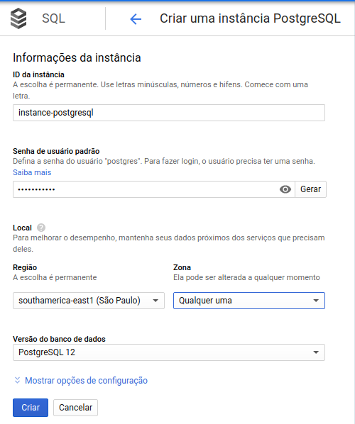
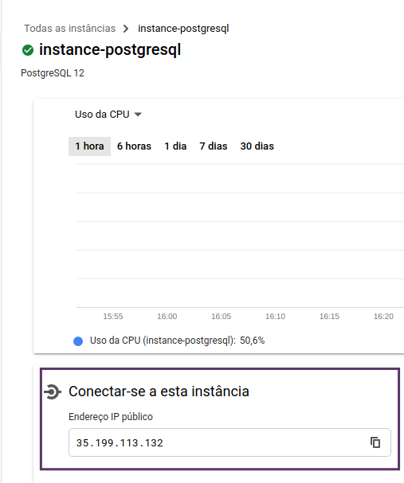
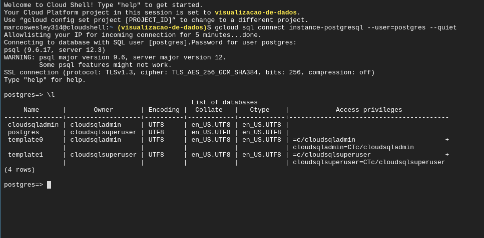
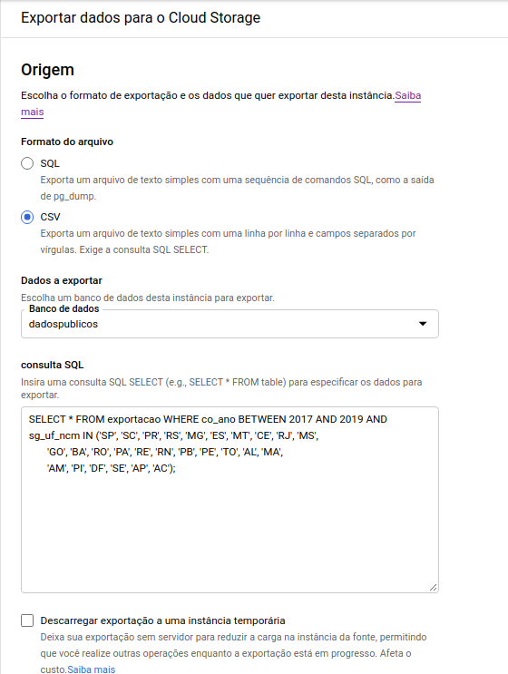
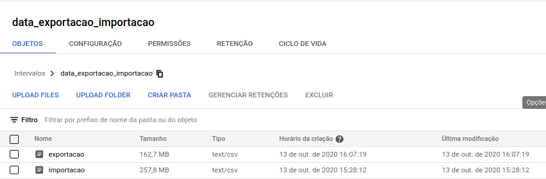

# Pipeline usando o Google Cloud Platform (GCP)

    

### Stack Tecnológica:

- CloudSQL;
- CloudStorage;
- BigQuery;
- DataStudio;
- Linguagens de programação: Shell Script e Python.

## Criação de uma instânica SQL

- Criei uma instância PostgreSQL para enviar os dados obtidos para o banco de dados *dadospublicos*.

    

        
    

- **Configurações de criação**

    

        
    

    Após a criação da instância será fornecido um endereço IP público que será usado para conectar ao banco de dados.

    

        
    

- Observando os bancos de dados existentes

    

        
    

## Extração e Carregamento dos dados

A extração e carregamento dos dados será realizado através de scripts shell e python. Esses scripts foram adicionados a um outro *elt.sh*  que será o responsável por realizar a execução das tarefas na seguinte ordem:

    ./dowload_dados.sh                   # Extração dos dados
    python3 scripts/create_tables.py     # Criação das tabelas no Cloud SQL
    python3 scripts/insert_data.py       # Inserir os dados do arquivo .csv para o Cloud SQL

Esses scripts foram excutados localmente através do acesso so CloudSQL via Google SDK. É possível encontrar como fazer a instalação através do link: https://cloud.google.com/sdk/docs/install?hl=pt-br#deb

Para acessar o Cloud SQL foi usado o seguinte comando e inserindo quando solicidato a senha do usuário que configuramos

    gcloud sql connect instance-postgresql --user=postgres --quiet

## Importando para o CloudStorage

- Para realizar a análise dos dados pensou em exporta-los do CloudSQL para o Cloud Storage e então conectar-se BigQuery. Eu já havia criado um bucket no Cloud Storage com o nome *data_exportacao_importacao*. 

    

        
    

- Realizei esse processo tanto para os dados de exportação quanto de importação.

    

        
    

## BigQuery

Foi utilizado para fazer algumas consultas SQL com o objetivo de responder as questões solicitadas e então com o auxílio do DataStudio, foi construído um dashboard que pode ser acessado através do link abaixo:

encurtador.com.br/gFSTU