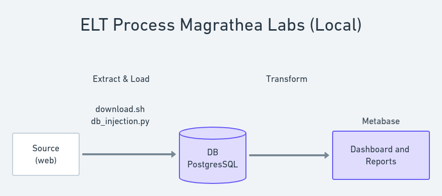
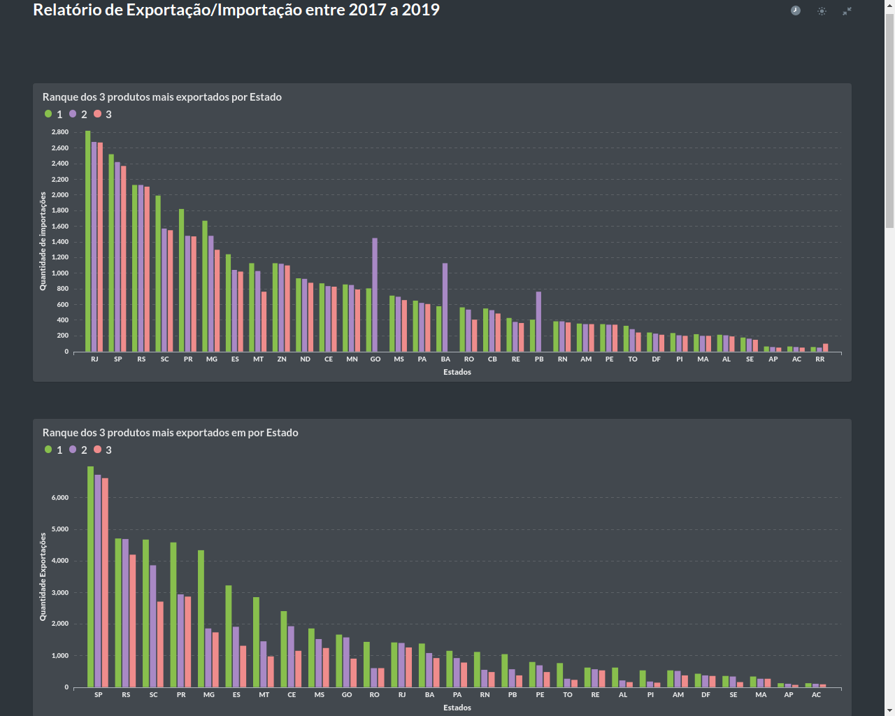
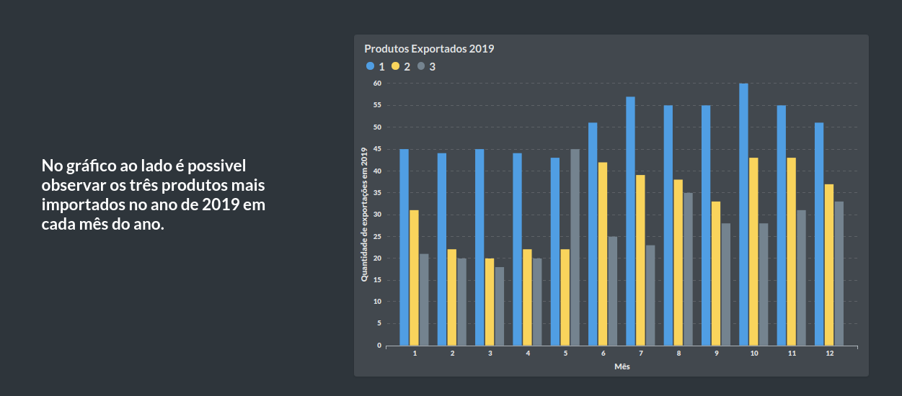
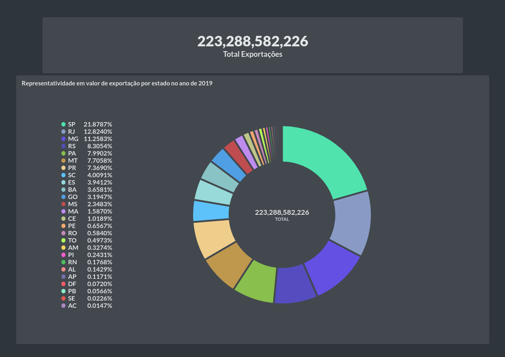
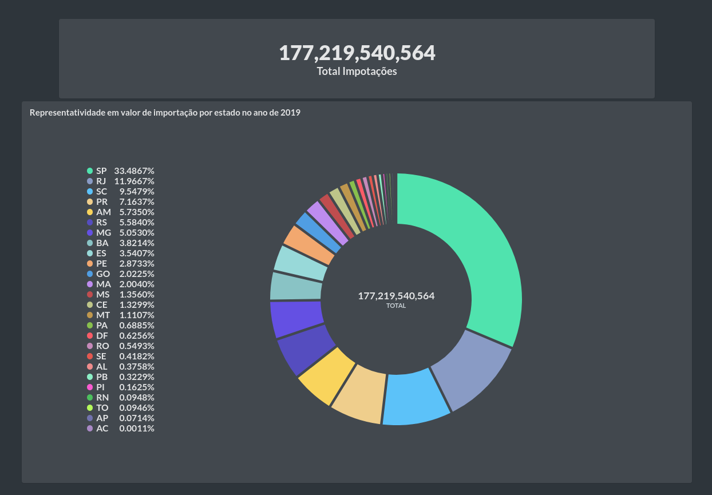

# Pipeline Local

    

Inicialmente foi pensando em realizar a extração dos dados e carregar em um banco de dados PostgreSQL e conectar o Metabase para a criação dos Dashboards. Todo esse processo foi realizado no entanto como não foi possível a disponibilização do dashboard publicamente foi pensado em outra abordagem.

### Stack Tecnológica:

- PostgresSQL: https://www.postgresql.org/
- Docker: https://www.docker.com/
- Metabase: https://www.metabase.com/
- Linguagens de programação: Shell Script e Python.
- 

### Execução do projeto

- **Extração dos dados**
    
        $ ./download_dados.sh

- **Carregamento no banco de dados**
    
    Esse script shell ira executar os arquivos create_table.py e insert_data.py respectivamente. 

        $ ./elt.sh

        $  docker pull metabase/metabase

- **Visualização**

    O dashboard foi criado usando a ferramenta metabase, para o uso da mesma foi necessário obter a sua imagem docker.

        $ docker pull metabase/metabase
    
    Para a execução da imagem utilizou-se o seguinte comando:

        $ docker run -d -p 3000:3000 --net=host --name metabase metabase/metabase

    A flag " *--net=host* " foi utilizada para que o metabase pudesse acessar o postgres localmente.

    

- A seguir é possível observar como ficou o Dashboard desenvolvido no Metabase.

    

    

    

    

